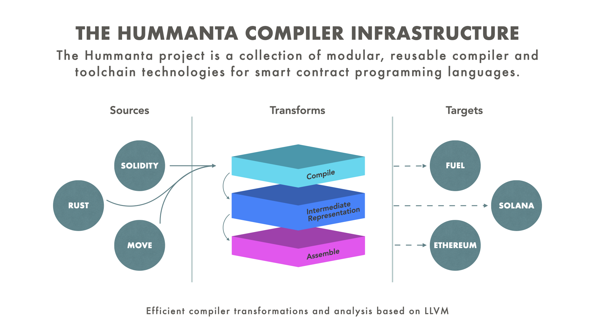

Hummanta is a collection of modular, reusable compiler technologies and a comprehensive framework for rapidly building smart contracts. Designed with flexibility and scalability in mind, Hummanta empowers developers to create efficient, reliable, and secure smart contracts with ease. For more details, see our [documentation](https://hummanta.github.io/docs/).
